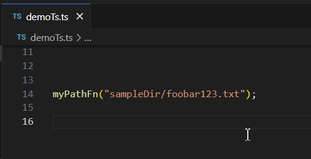
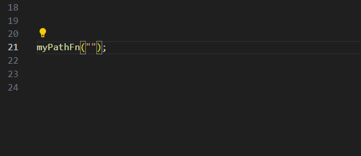
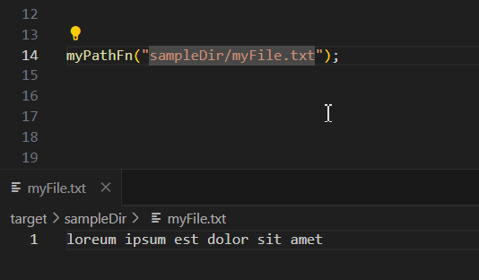
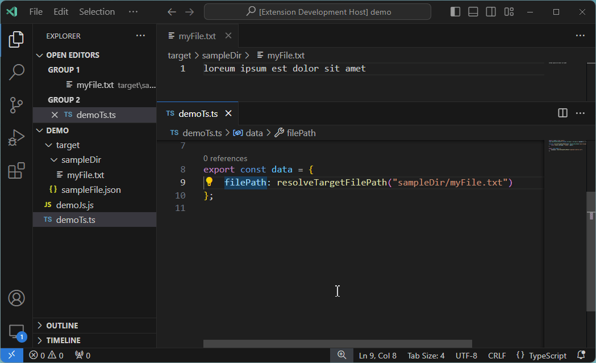
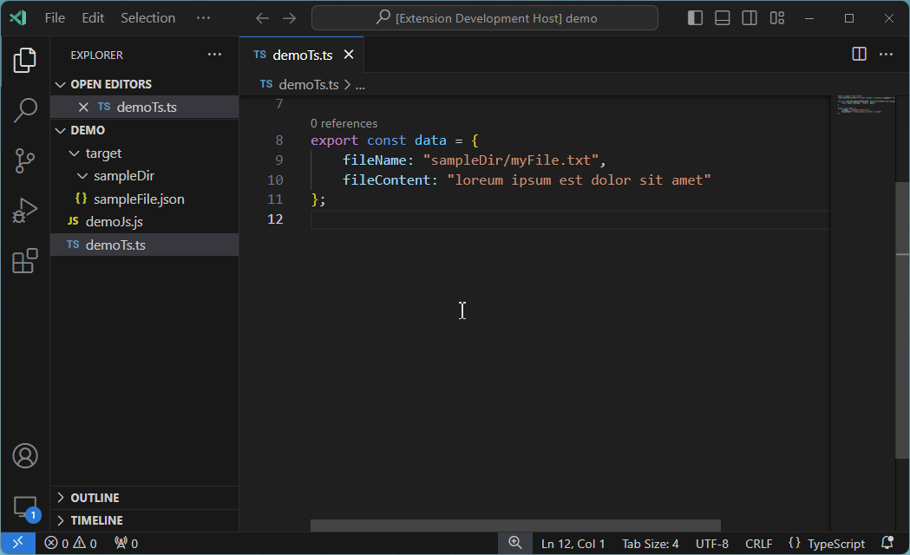

# TypeScript Relative File Path Support

## Setup

* Install this extension

* For TypeScript:
    * Declare a type of name `RelativeFilePath` with one type parameter:
        ```ts
        type RelativeFilePath<T extends string> = string & { baseDir?: T };
        ```
    * Declare a function that uses this type (the name of the function is arbitrary):
        ```ts
        function myFn(path: RelativeFilePath<'$dir/mySubDir'>) {
            // The implementation is up to you.
        }
        ```
* For JavaScript (use JS Docs to specify the types):
    ```js
    /**
     * @typedef {string & { foo?: TBaseDir }} RelativeFilePath
     * @template TBaseDir
     */

    /**
     * @param {RelativeFilePath<'$dir/mySubDir'>} path
     */
    function myFn(path) { ... }
    ```


* Use `$dir` to reference the full directory path to the file that defines the function.
* The first overloading of this function must have exactly one parameter which has to be of the mentioned type.
* Now you get editor support for file paths in `myFn` call expressions!
    ```ts
    // Relative to `mySubDir` in the directory of the source file that defines `myFn`
    myFn('myDir/myFile.txt');
    ```


## Features

### Go-To-Definition

Opens the referenced file in a new editor.



### Path-Completion

Provides auto-completion for file-paths (relative to the specified base directory).



### Renaming

Renames the referenced file and updates the file path.




### Inlining

Inlining deletes the referenced file on disk and inlines its content as `fileContent` property.
Only works on objects that have the shape `{ filePath: myPathFn("myRelativePathStr"), ...additionalProperties }`.



### Extraction

Extraction is the opposit of inlining: This action creates a file on disk with the specified content and references this file by a file path function in scope (which means it has to be in the same file or imported).
Only works on objects that have the shape `{ fileName: "myRelativeFileName", fileContent: "myFileContent", ...additionalProperties }`.



## Contributing

This project welcomes contributions and suggestions.  Most contributions require you to agree to a
Contributor License Agreement (CLA) declaring that you have the right to, and actually do, grant us
the rights to use your contribution. For details, visit https://cla.opensource.microsoft.com.

When you submit a pull request, a CLA bot will automatically determine whether you need to provide
a CLA and decorate the PR appropriately (e.g., status check, comment). Simply follow the instructions
provided by the bot. You will only need to do this once across all repos using our CLA.

This project has adopted the [Microsoft Open Source Code of Conduct](https://opensource.microsoft.com/codeofconduct/).
For more information see the [Code of Conduct FAQ](https://opensource.microsoft.com/codeofconduct/faq/) or
contact [opencode@microsoft.com](mailto:opencode@microsoft.com) with any additional questions or comments.

## Trademarks

This project may contain trademarks or logos for projects, products, or services. Authorized use of Microsoft 
trademarks or logos is subject to and must follow 
[Microsoft's Trademark & Brand Guidelines](https://www.microsoft.com/en-us/legal/intellectualproperty/trademarks/usage/general).
Use of Microsoft trademarks or logos in modified versions of this project must not cause confusion or imply Microsoft sponsorship.
Any use of third-party trademarks or logos are subject to those third-party's policies.
